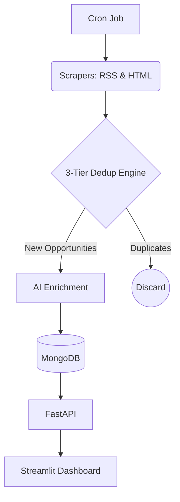

# 🚀 Startup Opportunity Aggregator


The Startup Opportunity Aggregator is a production-grade data pipeline designed to automate the discovery of grants, accelerators, and funding opportunities within the MedTech and Startup ecosystem. It leverages asynchronous web scraping, a robust 3-tier deduplication engine, and AI-driven tagging to deliver high-signal, structured data to an optimized Streamlit dashboard.

## Architecture



## Tech Stack Matrix

| Layer | Technology | Rationale |
| :--- | :--- | :--- |
| **Frontend** | Streamlit | Rapid development of interactive data applications; `@st.cache_data` ensures lightning-fast UI responsiveness. |
| **Backend** | FastAPI | High performance, asynchronous framework with built-in Pydantic validation for robust API development. |
| **Database** | MongoDB | Flexible schema for semi-structured scraping data; native JSON-like document storage. |
| **AI / Enrichment**| Gemini/Claude | LLMs for automated tagging, categorization, and metadata extraction, enforced via Pydantic schemas. |
| **Ingestion** | httpx, BeautifulSoup, feedparser | Asynchronous HTTP requests and robust parsing of both RSS feeds and unstructured HTML DOMs. |

## Quick Start Guide

```bash
# 1. Clone the repository
git clone https://github.com/yourusername/startup-opportunity-aggregator.git
cd startup-opportunity-aggregator

# 2. Set up the virtual environment
python -m venv venv
source venv/bin/activate  # On Windows use `venv\Scripts\activate`

# 3. Install dependencies
pip install -r requirements.txt

# 4. Configure environment variables
cp .env.example .env
# Edit .env with your MongoDB URI and API keys

# 5. Launch the backend (FastAPI)
uvicorn api:app --reload --port 8000

# 6. Launch the frontend (Streamlit) in a new terminal window
streamlit run app.py
```

## API Reference

| Endpoint | Method | Parameters | Description |
| :--- | :---: | :--- | :--- |
| `/opportunities` | `GET` | `page`, `limit`, `tags` | Retrieves a paginated list of enriched startup opportunities. |
| `/scraper-runs` | `GET` | `limit` | Returns audit logs and metrics from recent scraper executions. |
| `/run-scraper` | `POST` | `source_id` (optional) | Manually triggers the data ingestion and enrichment pipeline. |
