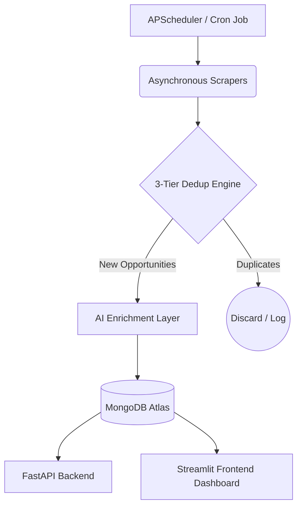

# 🚀 Startup Opportunity Aggregator

<div align="center">

### 🟢 **SYSTEM STATUS: LIVE & FULLY OPERATIONAL**

[](https://alfaleus.streamlit.app/)
[](https://alfaleus.streamlit.app/)

<p align="center">
  <a href="https://alfaleus.streamlit.app/">👉 <strong>CLICK HERE TO EXPLORE THE LIVE DASHBOARD</strong> 👈</a>
</p>

---


</div>

The **Startup Opportunity Aggregator** is a production-grade data pipeline designed to automate the discovery of grants, accelerators, and funding opportunities within the MedTech and Startup ecosystem. It leverages asynchronous web scraping, a robust **3-tier deduplication engine**, and **AI-driven tagging** to deliver high-signal, structured data to an optimized, premium Streamlit dashboard.

---

## 🌟 Key Highlights for Recruiters

*   ⚡ **Asynchronous Concurrency:** Built on `FastAPI` and `motor` (async MongoDB client) for non-blocking database queries and high-performance routing.
*   🛡️ **Strict Data Validation:** Utilizes `Pydantic v2` to enforce schemas at the ingestion layer, ensuring no corrupt or malformed scraped data reaches the database.
*   🧠 **3-Tier Deduplication:** Employs a multi-stage deduplication pipeline (exact URL matching, normalized SHA-256 content hashing, and token-based fuzzy matching) to eliminate noise.
*   ✨ **AI-Driven Enrichment:** Synthesizes metadata (funding ranges, startup stages, remote friendliness) using state-of-the-art LLMs via the `Google Gemini` API.
*   🎨 **Premium Dashboard:** Designed with customized CSS styling, dynamic glassmorphism KPI cards, search queries, multi-select filters, and a real-time system audit log.

---

## 📐 System Architecture



---

## 🛡️ The 3-Tier Deduplication Strategy

To prevent spam and keep the opportunity pipeline pure, data runs through three distinct gates:

1.  **Tier 1: Canonical URL Matching** (Instant database lookup to filter out exact URL duplicates).
2.  **Tier 2: Content Hashing** (Generates a deterministic SHA-256 hash based on normalized title, URL, and deadline to catch reposts).
3.  **Tier 3: Token-Based Fuzzy Matching** (Uses `rapidfuzz` to evaluate string similarity on titles. Titles scoring $\ge 85\%$ are flagged as duplicates).

---

## 📊 Tech Stack & Rationale

| Layer | Technology | Rationale |
| :--- | :--- | :--- |
| **Frontend** | Streamlit | Customized with sleek, dark-mode CSS styling. Leverages `@st.cache_data` for sub-second UI responsiveness. |
| **Backend** | FastAPI | Async routing framework with native OpenAPI (`/docs`) interactive generation. |
| **Database** | MongoDB Atlas | Flexible schema for semi-structured scraping data with text index searching configured. |
| **AI / Enrichment** | Gemini / Groq | Orchestrates Pydantic-enforced JSON schema extractions for accurate tagging. |
| **Ingestion** | `curl_cffi`, BeautifulSoup | Asynchronous HTTP client designed to handle complex Web Scrapes resiliently. |

---

## 🚀 Quick Start Guide

### 1. Set Up Environment
```bash
# Clone the repository
git clone https://github.com/singhuday26/Alfaleus_Assignment_3.git
cd Alfaleus_Assignment_3

# Set up virtual environment
python -m venv venv
source venv/bin/activate  # Windows: venv\Scripts\activate

# Install dependencies
pip install -r requirements.txt
```

### 2. Configure Credentials
Copy `.env.example` to `.env` and fill in your connection URIs:
```env
MONGO_URI=mongodb+srv://...
GEMINI_API_KEY=AIzaSy...
API_SECRET_KEY=your-secure-key
```

### 3. Launch Services
```bash
# Launch FastAPI backend
uvicorn api:app --reload --port 8000

# Launch Streamlit dashboard (in a separate terminal)
streamlit run app.py
```

---

## 🔌 API Reference

| Endpoint | Method | Parameters | Description |
| :--- | :---: | :--- | :--- |
| `/opportunities` | `GET` | `page`, `limit`, `source`, `type`, `is_remote` | Retrieves a paginated list of enriched, active opportunities. |
| `/stats` | `GET` | None | Returns pipeline metadata and KPI statistics. |
| `/scraper-runs` | `GET` | `limit`, `source` | Returns active audit logs from recent scraper pipeline executions. |
| `/run-scraper` | `POST` | `source` | Manually triggers the data ingestion and deduplication engine (requires `X-Api-Key`). |

---
*Developed with ❤️ as a production-grade showcase project.*
