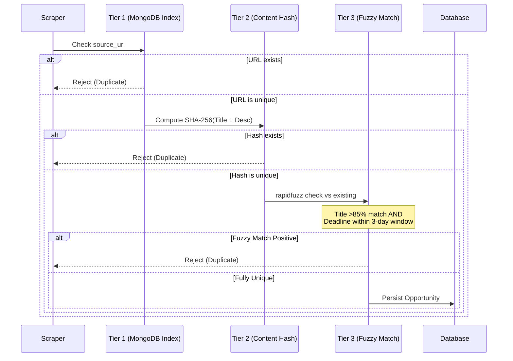

# Engineering Post-Mortem: Scraping Infrastructure

## Strategic Source Selection

| Source | Type | Selection Rationale & Implementation Details |
| :--- | :--- | :--- |
| **Opportunity Desk** | RSS | **Baseline Reliability.** RSS feeds provide structured, predictable data structures. Used as a high-fidelity baseline to guarantee a continuous flow of opportunities without complex DOM parsing. |
| **F6S** | HTML | **Volume & Reach.** Targeted for its massive volume of startup programs. Implemented recursive pagination handling to traverse F6S result pages systematically, relying on robust CSS selectors to extract core entities from unstructured HTML. |

## Anti-Scraping Mitigations

To maintain high availability and prevent interruptions during ingestion, the pipeline employs proactive defense mechanisms against common anti-scraping measures:

- **Dynamic Header Injection (`fake_useragent`)**: Rapid, automated requests from the same user-agent string immediately flag security systems. By rotating user-agents on a per-request basis using `fake_useragent`, the scrapers mimic organic browser traffic, effectively mitigating IP soft-bans and fingerprinting.
- **Exponential Backoff (`tenacity`)**: Distributed rate limiters often throw `HTTP 429 Too Many Requests` or transient `50x` errors. Using `tenacity`, the scraper implements intelligent exponential backoff and retry logic. This allows the pipeline to gracefully pause and recover during traffic spikes or brief server outages without crashing the ingestion run.

## The 3-Tier Deduplication Engine

To ensure absolute data integrity and prevent redundant AI processing costs, the system routes all incoming records through a strict 3-Tier Deduplication Engine before persistence.

## Scale Limitations & Future Roadmap

While the current architecture is robust for mid-volume ingestion, several bottlenecks must be addressed for enterprise-scale operation:

1. **In-Memory Fuzzy Matching**: The `rapidfuzz` Tier 3 check currently compares incoming records against an in-memory representation of the database. As the dataset scales beyond tens of thousands of records, this O(N) operation will consume excessive RAM and bottleneck the pipeline.
   * **Solution**: Migrate fuzzy matching to an optimized Elasticsearch or vector database (e.g., Pinecone/Milvus) for sub-millisecond similarity search at scale.
2. **IP Rate Limits**: `fake_useragent` alone cannot bypass strict, IP-based rate limiting imposed by platforms like Cloudflare or Datadome over sustained scraping periods.
   * **Solution**: Integrate a rotating residential proxy pool (e.g., BrightData, Oxylabs) to distribute the request load across thousands of distinct IPs.
3. **Synchronous Pipeline Execution**: The current APScheduler configuration executes the pipeline synchronously on a single node, limiting throughput.
   * **Solution**: Implement Celery with a Redis message broker to decouple ingestion, deduplication, and AI enrichment into distributed worker queues.
4. **JS-Heavy DOMs**: The `httpx` + `BeautifulSoup` stack cannot parse dynamically rendered Single Page Applications (SPAs).
   * **Solution**: Introduce Playwright for headless browser automation specifically for JS-heavy targets, utilizing its network interception capabilities to block unnecessary assets (images, fonts) for speed.
